# Enterprise HR AI — Notebook-to-Production RAG Architecture Mapping

> **Specification Document: Step 4A**  
> **Status:** Architectural Design & Reference Mapping  
> **Author:** Antigravity AI Engineering Team  
> **Target Date:** 2026-09-01  

---

## Executive Summary

The 8 reference RAG notebooks represent an authoritative reference implementation for advanced retrieval-augmented generation:
1. `01_simple_rag.ipynb` — Baseline vector retrieval & generation pipeline
2. `02_embedding_model.ipynb` — Embedding model evaluation & prefix-conditioned representation
3. `03_semantic_chunking.ipynb` — Statistical similarity & token-bounded chunking
4. `04_contextual_retrieval.ipynb` — Chunk contextualization (situating chunks in parent documents)
5. `05_reverse_hyde.ipynb` — Hypothetical question indexing (Reverse HyDE)
6. `06_hybrid_search.ipynb` — Dual-stage sparse (BM25) + dense retrieval with score normalization
7. `07_reranking.ipynb` — Cross-encoder semantic re-scoring
8. `08_multimodal_pdf.ipynb` — Vision-language multi-vector retrieval (ColPali)

This document audits the exact code, models, and dependencies of each notebook, compares them with our verified Step 2 (Ingestion/Chunking) and Step 3 (Embedding Evaluation) implementations, and establishes the formal target production architecture for the Enterprise HR AI platform.

---

## 1. Notebook-by-Notebook Detailed Analysis

### Notebook 01: `01_simple_rag.ipynb` (Baseline RAG)
* **Technique:** Basic vector search + context augmentation + LLM generation.
* **Libraries Imported:** `qdrant_client`, `sentence_transformers`, `openai`, `rich`, `rich_theme_manager`, `dotenv`, `pandas`, `warnings`.
* **Exact Model(s) Used:**
  * Dense Embedding: `SentenceTransformer('all-MiniLM-L6-v2')` (384-dim, cosine distance).
  * Generator: `OpenAI(model="gpt-3.5-turbo")`.
* **Implementation Approach:**
  * Ingests a structured CSV (`wines.csv`) into Pandas.
  * Encodes the `notes` column with MiniLM into an in-memory Qdrant collection (`qdrant = QdrantClient(":memory:")`).
  * Encodes the user query vector using the same encoder.
  * Searches Qdrant with `limit=3`.
  * Augments a simple chat prompt with raw retrieved payloads: `[{"role": "user", "content": query}, {"role": "assistant", "content": str(search_results)}]`.
* **Input Format:** Tabular CSV records with text notes; raw text user query string.
* **Output Format:** Plaintext chat completion from OpenAI.
* **Dependencies:** `qdrant-client`, `sentence-transformers`, `openai`.
* **Notebook-Specific Limitations:**
  * In-memory ephemeral Qdrant storage (`:memory:`) without persistence.
  * Unformatted JSON dump passed to the LLM without citation formatting or section provenance.
  * Zero grounding verification or retrieval score thresholding (hallucinates if query is out-of-domain).
  * Hardcoded OpenAI API key dependency.

---

### Notebook 02: `02_embedding_model.ipynb` (Embedding Layer)
* **Technique:** Embedding representations, token similarity inspection, and bi-encoder prefix conditioning.
* **Libraries Imported:** `transformers`, `torch`, `sentence_transformers`, `datasets`, `altair`, `pandas`, `seaborn`, `matplotlib`, `tabulate`, `rich`, `dotenv`.
* **Exact Model(s) Used:**
  * Baseline Dense: `SentenceTransformer('all-MiniLM-L6-v2')`.
  * Commercial Baseline: `OpenAI(model="text-embedding-3-small")`.
  * Advanced Bi-Encoder: `transformers.AutoModel.from_pretrained("jxm/cde-small-v1", trust_remote_code=True)` (Contextual Document Embeddings) with `AutoTokenizer.from_pretrained("bert-base-uncased")`.
* **Implementation Approach:**
  * Inspects token embeddings from the embedding layer vs final transformer hidden states.
  * Visualizes token-to-token cosine similarity matrices using Altair heatmaps.
  * Implements query/document asymmetric prefix conditioning for CDE:
    * `query_prefix = "search_query: "`
    * `document_prefix = "search_document: "`
  * Evaluates representation quality on the Financial Opinion Mining dataset (`BeIR/fiqa`).
* **Input Format:** Tokenized string batches padded/truncated to `max_length=512`.
* **Output Format:** Dense PyTorch embedding tensors; normalized cosine similarity heatmaps.
* **Dependencies:** `transformers`, `torch`, `datasets`, `altair`, `seaborn`.
* **Notebook-Specific Limitations:**
  * `jxm/cde-small-v1` requires `trust_remote_code=True` and a specialized two-stage mini-corpus pre-encoding pass (`improved_model.first_stage_model`), introducing substantial runtime overhead.
  * Interactive visualization code (Altair/Seaborn) cannot run in headless production API services.

---

### Notebook 03: `03_semantic_chunking.ipynb` (Chunking Layer)
* **Technique:** Statistical semantic chunking using sliding window embedding distances.
* **Libraries Imported:** `semantic_chunkers` (`StatisticalChunker`), `semantic_router.encoders` (`OpenAIEncoder`), `datasets`, `rich`, `dotenv`.
* **Exact Model(s) Used:**
  * Chunking Encoder: `semantic_router.encoders.OpenAIEncoder(name="text-embedding-3-small")`.
  * Chunker Class: `StatisticalChunker(encoder=encoder, min_split_tokens=100, max_split_tokens=500, enable_statistics=True)`.
* **Implementation Approach:**
  * Loads long scientific papers from `jamescalam/ai-arxiv2`.
  * Computes cosine distance between consecutive sentences.
  * Splits documents dynamically when sentence similarity drops below a rolling statistical threshold (e.g. mean + standard deviation of sentence distances).
  * Binds split tokens between `min_split_tokens=100` and `max_split_tokens=500`.
  * Builds chunk metadata containing document title, prechunk (previous chunk context), and postchunk (next chunk context).
* **Input Format:** Unstructured multi-page document text (`content` field).
* **Output Format:** Structured chunk objects containing `splits` and sliding contextual metadata (`prechunk`, `postchunk`).
* **Dependencies:** `semantic-chunkers`, `semantic-router`, `openai`.
* **Notebook-Specific Limitations:**
  * Requires generating embedding vectors for *every individual sentence* via external OpenAI API during ingestion, creating high latency and API token cost.
  * Oblivious to formal markdown structural hierarchies (`##` headings, table rows, code blocks), risking table fragmentation.

---

### Notebook 04: `04_contextual_retrieval.ipynb` (Contextual Enrichment)
* **Technique:** LLM-generated situational context prepended to individual chunks (Anthropic Contextual Retrieval).
* **Libraries Imported:** `anthropic`, `semantic_chunkers`, `semantic_router`, `datasets`, `tqdm`, `rich`, `dotenv`.
* **Exact Model(s) Used:**
  * Chunker: `StatisticalChunker` with `OpenAIEncoder`.
  * Contextual Generator: `anthropic.Anthropic(model="claude-3-5-sonnet-20241022")`.
* **Implementation Approach:**
  * Chunks documents using `StatisticalChunker`.
  * Calls Claude 3.5 Sonnet for each chunk using the prompt:
    ```markdown
    <document>
    {doc_content}
    </document>
    Here is the chunk we want to situate within the whole document
    <chunk>
    {chunk_content}
    </chunk>
    Please give a short succinct context to situate this chunk within the overall document for the purposes of improving search retrieval of the chunk.
    ```
  * Prepend the generated context to the chunk:
    `contextualized_text = f"{chunk_text}\n\n{context}"`
  * Saves the resulting corpus to `data/corpus.json`.
* **Input Format:** Full parent document string + individual chunk string.
* **Output Format:** JSON corpus of contextualized chunks.
* **Dependencies:** `anthropic`, `semantic-chunkers`, `datasets`.
* **Notebook-Specific Limitations:**
  * High monetary cost and latency: executing LLM generation for 1,000+ chunks requires 1,000+ external API calls.
  * Non-deterministic context generation if temperature > 0.

---

### Notebook 05: `05_reverse_hyde.ipynb` (Query Expansion / Hypothetical Questions)
* **Technique:** Reverse Hypothetical Document Embeddings (Reverse HyDE) via offline question generation.
* **Libraries Imported:** `qdrant_client`, `sentence_transformers`, `openai`, `numpy`, `sklearn.metrics.pairwise`, `uuid`, `rich`, `dotenv`.
* **Exact Model(s) Used:**
  * Question Generator: `OpenAI(model="gpt-3.5-turbo")`.
  * Embedding Model: `SentenceTransformer('all-MiniLM-L6-v2')`.
  * Vector Store: `QdrantClient(":memory:")`.
* **Implementation Approach:**
  * **Offline Generation:** Takes each text chunk and prompts GPT-3.5-Turbo:
    `"Given the following text chunk, generate {n} different questions that this chunk would be a good answer to:"`
  * **Indexing:** Vectorizes each generated question (e.g. 5 questions per chunk) and stores them in Qdrant, with payload pointing back to the parent chunk.
  * **Online Query:** Embeds user query and matches against the *generated questions* instead of raw chunk text.
  * Demonstrates that user query-to-question similarity produces higher cosine scores than query-to-chunk similarity.
* **Input Format:** Text chunks -> List of hypothetical questions.
* **Output Format:** Qdrant points indexed by question vectors.
* **Dependencies:** `qdrant-client`, `sentence-transformers`, `openai`.
* **Notebook-Specific Limitations:**
  * Multiplies vector database size by $N$ (e.g. 5x vectors for 1,042 chunks = 5,210 vectors).
  * Requires external LLM generation pass across the entire corpus during ingestion.

---

### Notebook 06: `06_hybrid_search.ipynb` (BM25 + Dense Hybrid Retrieval)
* **Technique:** Sparse BM25 + Dense Vector Search + Min-Max Score Normalization + Weighted Combination.
* **Libraries Imported:** `bm25s`, `Stemmer` (PyStemmer), `qdrant_client`, `sentence_transformers`, `openai`, `numpy`, `rich`, `dotenv`.
* **Exact Model(s) Used:**
  * Sparse Index: `bm25s.BM25(corpus=corpus_json)` with `Tokenizer(stemmer=english_stemmer, stopwords="english")`.
  * Dense Index: `SentenceTransformer('all-MiniLM-L6-v2')` into in-memory Qdrant (`qdrant_client = QdrantClient(":memory:")`).
  * LLM Generator: `OpenAI(model="gpt-3.5-turbo")`.
* **Implementation Approach:**
  1. Tokenizes and indexes corpus using `bm25s` with English stemming and stop-word filtering.
  2. Embeds corpus with MiniLM and indexes in Qdrant.
  3. Executes dual retrieval for query:
     * Dense top-10: `dense_results = qdrant_client.search(..., limit=10)`
     * Sparse top-10: `sparse_results, sparse_scores = sparse_index.retrieve(query_tokens, k=10)`
  4. Collects union of retrieved document IDs.
  5. Applies Min-Max normalization to separate score spaces:
     $$\text{dense}_{\text{norm}} = \frac{\text{dense} - \min(\text{dense})}{\max(\text{dense}) - \min(\text{dense})}$$
     $$\text{sparse}_{\text{norm}} = \frac{\text{sparse} - \min(\text{sparse})}{\max(\text{sparse}) - \min(\text{sparse})}$$
  6. Computes weighted fusion score with $\alpha = 0.2$:
     $$\text{Score}_{\text{final}} = (1 - \alpha) \cdot \text{dense}_{\text{norm}} + \alpha \cdot \text{sparse}_{\text{norm}}$$
  7. Sorts candidate documents descending by $\text{Score}_{\text{final}}$ and extracts top 3 for LLM generation.
* **Input Format:** Query text string; pre-tokenized sparse tokens + dense query vector.
* **Output Format:** Top-3 merged documents with unified hybrid scores; synthesized response.
* **Dependencies:** `bm25s`, `pystemmer`, `qdrant-client`, `sentence-transformers`, `openai`.
* **Notebook-Specific Limitations:**
  * Requires dual in-memory databases (`bm25s` index + `Qdrant`).
  * Relies on Min-Max normalization across small top-10 result sets, which can be sensitive to outlier scores compared to Reciprocal Rank Fusion (RRF).

---

### Notebook 07: `07_reranking.ipynb` (Cross-Encoder Reranking)
* **Technique:** Second-stage cross-encoder semantic re-scoring of hybrid retrieval candidates.
* **Libraries Imported:** `sentence_transformers` (`CrossEncoder`), `openai`, `numpy`, `rich`, `dotenv`.
* **Exact Model(s) Used:**
  * Reranker Model: `CrossEncoder("cross-encoder/ms-marco-MiniLM-L-6-v2")`.
  * LLM Generator: `OpenAI(model="gpt-3.5-turbo")`.
* **Implementation Approach:**
  1. Loads candidate documents from previous hybrid search stage (`dense_results.json` and `sparse_results.json`).
  2. Constructs explicit query-document pair tuples:
     `pairs = [[query, doc['text']] for doc in hybrid_search_results.values()]`
  3. Evaluates full cross-attention interaction scores using the cross-encoder:
     `scores = cross_encoder.predict(pairs)`
  4. Combines cross-encoder score with document metadata:
     `results_with_scores = [(doc_id, text, score) for ...]`
  5. Sorts descending by score and selects top 3:
     `top_results = sorted(results_with_scores, key=lambda x: x[2], reverse=True)[:3]`
  6. Augments LLM prompt with reranked documents.
* **Input Format:** Query text + List of candidate document strings.
* **Output Format:** Calibrated relevance scores (logits); ordered top-3 document list.
* **Dependencies:** `sentence-transformers`, `openai`.
* **Notebook-Specific Limitations:**
  * Reads static JSON files from disk (`data/dense_results.json`, `data/sparse_results.json`) rather than connecting dynamically as a pipeline stage.
  * No threshold gating on negative reranking logits (can return top-3 irrelevant docs if all scores are negative).

---

### Notebook 08: `08_multimodal_pdf.ipynb` (Multimodal Document Retrieval)
* **Technique:** Visual page representation and multi-vector retrieval using ColPali.
* **Libraries Imported:** `pdf2image`, `colpali_engine.models` (`ColPali`, `ColPaliProcessor`), `qdrant_client`, `anthropic`, `torch`, `tqdm`, `rich`.
* **Exact Model(s) Used:**
  * Vision Model: `ColPali.from_pretrained("vidore/colpali-v1.2")` with `torch_dtype=torch.bfloat16`.
  * Vision Processor: `ColPaliProcessor.from_pretrained("vidore/colpaligemma-3b-pt-448-base")`.
  * Visual Generator: `anthropic.Anthropic(model="claude-3-5-sonnet-20241022")`.
* **Implementation Approach:**
  1. Converts PDF pages into PNG images using `pdf2image.convert_from_path(pdf_path)`.
  2. Processes each page image with `colpali_processor` and encodes multi-vectors using `ColPali`.
  3. Uploads page image multi-vector patches into Qdrant using scalar quantization (`ScalarQuantizationConfig`).
  4. Processes text query with `colpali_processor.process_queries([query_text])`.
  5. Executes multi-vector MaxSim search in Qdrant to find the most visually relevant page images.
  6. Encodes retrieved page image to base64 and passes it directly to Claude 3.5 Sonnet to answer questions referencing charts, diagrams, or visual layouts.
* **Input Format:** PDF file path -> Rendered PIL Images; text query.
* **Output Format:** Retrieved page image thumbnails; multimodal Claude response.
* **Dependencies:** `colpali-engine`, `pdf2image`, `qdrant-client`, `anthropic`, `torch`, `poppler`.
* **Notebook-Specific Limitations:**
  * Extremely heavy compute footprint: requires 3B+ parameter vision model (`colpaligemma-3b`) running on Apple Silicon MPS or CUDA with multi-gigabyte VRAM.
  * Requires external binary dependency (`poppler`) on the host operating system.

---

## 2. Notebook-to-Production Mapping Matrix

| Notebook | Core Technique | Actual Implementation in Notebook | Target Production Module | Production Decision | Engineering Rationale |
|:---|:---|:---|:---|:---:|:---|
| **01_simple_rag** | Baseline RAG | Qdrant `:memory:` + MiniLM + Top-3 prompt injection | `app/rag/qa_chain.py` | **Adapt** | Baseline RAG structure is already adapted into `qa_chain.py`. We enhance it by adding pure score-threshold refusal gates and verified citation auditing. |
| **02_embedding_model** | Embedding Layer | `all-MiniLM-L6-v2` + `jxm/cde-small-v1` with `search_query:` / `search_document:` prefix | `app/rag/embeddings.py` | **Adapt** | In Step 3, we benchmarked candidates against our real HR corpus. `BAAI/bge-small-en-v1.5` achieved 100% Hit@5 and 0.8785 MRR (vs 0.8387 for MiniLM). We adopt the notebook's asymmetric prefix pattern using BGE's formal instruction prefix: `"Represent this sentence for searching relevant passages: "`. |
| **03_semantic_chunking** | Chunking Layer | `StatisticalChunker` with OpenAI sentence embeddings | `app/rag/chunking/chunker.py` | **Adapt** | Statistical chunking calls external embedding models per sentence, breaking markdown table structure. In Step 2, we implemented deterministic structure-aware chunking (Markdown heading hierarchy, table integrity, sentence-boundary fallback, 100-400 token limits). |
| **04_contextual_retrieval** | Contextual Enrichment | Anthropic Claude 3.5 Sonnet generating 2-sentence context per chunk | `app/rag/chunking/enricher.py` | **Adapt** | Claude API calls on 1,042 chunks during ingestion incur unnecessary cost and external dependency. In Step 2, we adapted this into deterministic metadata header prefixing: `[Document: ...] [Section: ...] [Document Type: ...]`, which provides identical retrieval grounding with zero API calls. |
| **05_reverse_hyde** | Reverse HyDE | Offline GPT-3.5 question generation per chunk; matches query against questions | `app/rag/enrichment/reverse_hyde.py` | **Do not use yet** | Reverse HyDE requires synthesizing 3,000+ hypothetical questions via LLM offline. Because our BGE embedding model already achieves 100% Hit@5 on real queries, Reverse HyDE is reserved as an optional offline enrichment pass if keyword mismatch is observed in production. |
| **06_hybrid_search** | Hybrid Retrieval | `bm25s` sparse + Qdrant dense + Min-Max score normalization with $\alpha=0.2$ | `app/rag/retriever.py` | **Reuse & Adapt** | Directly reuse the dense + sparse combination principle. We adapt `bm25s` to `rank-bm25` (already installed in our environment) and evaluate both weighted score combination ($\alpha=0.2$) and Reciprocal Rank Fusion (RRF) over ChromaDB. |
| **07_reranking** | Cross-Encoder Reranking | `CrossEncoder("cross-encoder/ms-marco-MiniLM-L-6-v2")` scoring `[query, doc]` pairs | `app/rag/reranker.py` | **Reuse** | Directly reuse the exact `cross-encoder/ms-marco-MiniLM-L-6-v2` model and pair scoring mechanism. It is lightweight, CPU-efficient, and provides an authoritative second-stage ranking pass before context generation. |
| **08_multimodal_pdf** | Multimodal Document RAG | ColPali multi-vector vision embeddings + Qdrant + Claude 3.5 Sonnet | `app/rag/multimodal/` | **Keep as optional branch** | Our current verified HR corpus consists strictly of tabular CSVs (`occupation_master.csv`, `jobrole_onet_mapping.csv`) and Markdown files (`model_card.md`, `data_relationships.md`). Zero PDF manuals exist. ColPali will be retained as an optional architectural branch when PDF employee handbooks are introduced. |

---

## 3. Comparison with Step 2 Implementation

We evaluated our completed Step 2 implementation against Notebooks 03 and 04:

### 1. Document & Chunk Abstractions
* **Notebooks (01, 04, 05, 06):** Used unstructured dictionaries with ad-hoc keys (`{"id": ..., "text": ..., "content": ...}`).
* **Step 2 Production:** Created typed Pydantic models (`Document` and `Chunk` in `app/rag/schemas.py`) enforcing immutable identifiers (`doc_id`, `chunk_id`), file types, document categories (`occupation`, `role_mapping`, `governance`, `architecture`), and token counts.
* **Verdict:** Direct production upgrade. No rollback needed.

### 2. Chunking Methodology
* **Notebook 03:** Employs `StatisticalChunker` with dynamic sentence-distance cutoffs.
* **Step 2 Production:** Employs structure-aware chunking (`app/rag/chunking/chunker.py`). Markdown documents are split strictly by heading hierarchy (`#`, `##`) without detaching headings from text; tables are preserved intact; O\*NET descriptions are kept unified unless exceeding 400 tokens, where sentence boundaries are respected.
* **Verdict:** Structure-aware chunking is superior for technical markdown and tabular data because statistical embedding distance frequently fragments markdown tables and deletes heading context.

### 3. Contextual Enrichment
* **Notebook 04:** Sends every chunk and parent document to Anthropic Claude 3.5 Sonnet to generate an explanatory paragraph.
* **Step 2 Production:** Constructs deterministic hierarchical metadata headers (`[Document: ...] [Section: ...] [Document Type: ...]`).
* **Verdict:** Deterministic prefixing achieved 100% Hit@5 in our Step 3 benchmark with zero external LLM API cost. If complex cross-document narrative synthesis is needed later, an offline LLM summarization pass can be layered on top.

### 4. Normalization & Code Preservation
* **Notebooks:** Provide zero normalization; raw strings are passed directly into tokenizers.
* **Step 2 Production:** Implemented `app/rag/normalization.py` with NFKC normalization, newline cleanup, and strict preservation of critical alphanumeric tokens (`19-1042.00`, `0.40`, `SHAP`, `O*NET`, `|`).
* **Verdict:** Critical production requirement fulfilled.

---

## 4. Deep-Dive: Embedding Notebook (`02_embedding_model.ipynb`)

### Implementation Findings
1. **Model Architecture:** The notebook evaluates `SentenceTransformer('all-MiniLM-L6-v2')` and introduces `jxm/cde-small-v1` (Contextual Document Embeddings).
2. **Prefix Conditioning:** The notebook demonstrates that asymmetric retrieval tasks benefit significantly from task-specific prefixes:
   * Notebook CDE: `query_prefix = "search_query: "` and `document_prefix = "search_document: "`
   * In Step 3, our empirical evaluation demonstrated that `BAAI/bge-small-en-v1.5` outperforms both MiniLM and GTE-Base, utilizing BGE's standard query instruction:
     `"Represent this sentence for searching relevant passages: "`
3. **Similarity Calculation:** The notebook calculates cosine similarity using PyTorch matrix multiplication after L2 normalization: `(doc_embeddings @ query_embeddings.T)`.
4. **Batching:** Uses standard PyTorch DataLoader/batch loops with `batch_size = 32` and `max_length = 512`.

---

## 5. Deep-Dive: Hybrid Search Notebook (`06_hybrid_search.ipynb`)

### Implementation Findings
1. **Sparse Representation:** Uses `bm25s` with English stemming (`PyStemmer`) and stopword removal.
2. **Dense Representation:** Uses `all-MiniLM-L6-v2` with Qdrant cosine search (`limit=10`).
3. **Score Combination Formula:**
   * Gathers candidate document union from top-10 dense and top-10 sparse results.
   * Applies Min-Max normalization independently:
     $$S_{\text{dense\_norm}} = \frac{S_{\text{dense}} - \min(S_{\text{dense}})}{\max(S_{\text{dense}}) - \min(S_{\text{dense}})}$$
     $$S_{\text{sparse\_norm}} = \frac{S_{\text{sparse}} - \min(S_{\text{sparse}})}{\max(S_{\text{sparse}}) - \min(S_{\text{sparse}})}$$
   * Computes weighted combination with $\alpha = 0.2$ (80% dense weight, 20% sparse weight):
     $$S_{\text{hybrid}} = 0.8 \cdot S_{\text{dense\_norm}} + 0.2 \cdot S_{\text{sparse\_norm}}$$
4. **Production Adaptation:**
   * In our production environment, `rank-bm25` is already installed. We will implement both the notebook's Min-Max weighted combination and Reciprocal Rank Fusion (RRF):
     $$\text{RRF}(d) = \sum_{m \in \{\text{dense}, \text{sparse}\}} \frac{1}{k + \text{rank}_m(d)} \quad (k = 60)$$
   * RRF is more robust when dense and sparse candidate score distributions have unequal variance.

---

## 6. Deep-Dive: Reranking Notebook (`07_reranking.ipynb`)

### Implementation Findings
1. **Model:** `cross-encoder/ms-marco-MiniLM-L-6-v2` loaded via `from sentence_transformers import CrossEncoder`.
2. **Input Format:** List of 2-element lists: `pairs = [[query, doc['text']] for doc in candidates]`.
3. **Scoring:** Evaluates pairs simultaneously through cross-attention: `scores = cross_encoder.predict(pairs)`.
4. **Selection:** Sorts descending by logit score and takes top $K$ (e.g. top 3 or top 5).
5. **Production Adaptation:** Directly reusable. We will wrap this in `app/rag/reranker.py` with an absolute score floor (e.g. `score >= -4.0`) to avoid passing irrelevance signals to the generator.

---

## 7. Deep-Dive: Reverse HyDE Notebook (`05_reverse_hyde.ipynb`)

### Implementation Findings
1. **Mechanism:** Rather than expanding the query at runtime (traditional HyDE), Reverse HyDE expands the *documents* at ingestion time by generating 3 to 5 hypothetical questions that the chunk answers.
2. **Storage:** The generated questions are embedded and stored as vector points pointing back to the parent chunk's payload.
3. **Retrieval Impact:** When a user asks a question, query-to-question similarity produces higher cosine scores than query-to-document similarity because both vectors reside in the "interrogative" semantic space.
4. **Production Decision:**
   * In our evaluation (Step 3), `BAAI/bge-small-en-v1.5` already achieved **1.000 Hit@5 and 1.000 Hit@10** without question expansion.
   * Running Reverse HyDE across 1,042 chunks would require generating ~5,200 questions with an LLM.
   * **Recommendation:** Defer Reverse HyDE. Keep the module specification ready, but do not block Step 4/5 on an offline LLM generation run.

---

## 8. Deep-Dive: Multimodal Notebook (`08_multimodal_pdf.ipynb`)

### Implementation Findings
1. **Architecture:** Uses ColPali (`vidore/colpali-v1.2`), a vision-language multi-vector model based on PaliGemma (3B parameters).
2. **Document Ingestion:** Renders PDF pages to images via `pdf2image` and computes multi-vector patch embeddings.
3. **Retrieval & Answering:** Retrieves page images using MaxSim in Qdrant and feeds base64 image strings to Claude 3.5 Sonnet.
4. **Compatibility Assessment:**
   * Our knowledge corpus contains 1,016 O\*NET text occupations and 17 technical Markdown sections.
   * Zero PDF manuals, diagrams, or scanned images exist in the project repository.
   * ColPali requires multi-gigabyte GPU memory, PyTorch MPS/CUDA, and the external `poppler` binary.
5. **Production Decision:**
   * **Category C: Kept as an optional multimodal branch.**
   * Do NOT integrate ColPali into the core text RAG pipeline. If image-heavy benefits booklets or executive slide decks are ingested in future phases, activate the multimodal branch.

---

## 9. Target Production RAG Architecture

The following target architecture synthesizes the techniques verified in Notebooks 01–07:

```mermaid
flowchart TD
    subgraph Offline_Document_Pipeline ["Document Pipeline (Ingestion & Indexing)"]
        D1["occupation_master.csv"] --> L1["csv_loader.py"]
        D2["jobrole_onet_mapping.csv"] --> L1
        D3["model_card.md"] --> L2["markdown_loader.py"]
        D4["data_relationships.md"] --> L2

        L1 --> NORM["normalization.py\n(NFKC, Tables, Codes)"]
        L2 --> NORM

        NORM --> CHUNK["chunking/chunker.py\n(Structure-Aware, 100-400 tok)\n[from Notebook 03]"]
        CHUNK --> ENRICH["chunking/enricher.py\n([Doc] [Section] [Type])\n[from Notebook 04]"]

        ENRICH --> DENSE_IDX["ChromaDB Vector Store\n(BAAI/bge-small-en-v1.5, 384-dim)\n[from Notebook 02]"]
        ENRICH --> SPARSE_IDX["BM25 Index\n(rank-bm25 / bm25s)\n[from Notebook 06]"]
    end

    subgraph Online_Query_Pipeline ["Query Pipeline (Retrieval & Generation)"]
        UQ["User Query"] --> PREF["Query Conditioning\n('Represent this sentence... ')\n[from Notebook 02]"]

        PREF --> D_SEARCH["Dense Retrieval\n(Top-20 Chunks)\n[from Notebook 02, 06]"]
        PREF --> S_SEARCH["BM25 Sparse Retrieval\n(Top-20 Chunks)\n[from Notebook 06]"]

        D_SEARCH --> FUSION["Hybrid Fusion\n(RRF / Min-Max Weighted α=0.2)\n[from Notebook 06]"]
        S_SEARCH --> FUSION

        FUSION --> CAND["Candidate Union (Top-15)"]
        CAND --> RERANK["Cross-Encoder Reranker\n(ms-marco-MiniLM-L-6-v2)\n[from Notebook 07]"]

        RERANK --> GATE{"Score Threshold Gate\n(Relevance Score ≥ Threshold)\n[Platform Rule]"}

        GATE -- "Score < Cutoff" --> REFUSAL["Deterministic Refusal Notice\n('Information not in knowledge base')"]
        GATE -- "Score ≥ Cutoff" --> TOP_K["Top-3 Audited Sources"]

        TOP_K --> GEN["Flan-T5 / Local LLM\n[from Notebook 01]"]
        GEN --> ANS["Audited Answer + Source Citations"]
    end
```



### Component-to-Notebook Reference
* **Document Loaders:** `app/rag/loaders/` (Custom verified loaders for HR tables and model documentation).
* **Text Normalization:** `app/rag/normalization.py` (Production hardening for tabular codes and symbols).
* **Chunking Engine:** `app/rag/chunking/chunker.py` (Adapted from Notebook 03; deterministic structural boundaries).
* **Contextual Enrichment:** `app/rag/chunking/enricher.py` (Adapted from Notebook 04; deterministic prefix headers).
* **Embedding Model:** `BAAI/bge-small-en-v1.5` (Empirically chosen in Step 3; prefix pattern from Notebook 02).
* **Dense Vector Database:** `ChromaDB` (Persistent storage replacing ephemeral Qdrant `:memory:` from Notebooks 01, 05, 06).
* **Sparse Index:** `rank-bm25` / `bm25s` (Adapted from Notebook 06).
* **Hybrid Fusion:** `(1 - \alpha)\text{Dense} + \alpha\text{Sparse}` ($\alpha = 0.2$) or RRF (Directly adapted from Notebook 06).
* **Reranker:** `cross-encoder/ms-marco-MiniLM-L-6-v2` (Directly reused from Notebook 07).
* **Refusal & Grounding Gate:** Pure score threshold (Platform rule enforcing honest grounding).
* **Generator:** `google/flan-t5-base` (Local Seq2Seq LLM replacing OpenAI API calls from Notebook 01).

---

## 10. Open Questions & Architectural Decisions

1. **Fusion Algorithm Selection (RRF vs Min-Max Weighted):**
   * *Option A (Notebook 06):* Min-Max score normalization followed by weighted sum ($0.8 \cdot \text{Dense} + 0.2 \cdot \text{Sparse}$).
   * *Option B (Information Retrieval Standard):* Reciprocal Rank Fusion (RRF, $k=60$).
   * *Decision:* Implement both in `app/rag/retriever.py` and benchmark their impact on `Hit@1` and `MRR` in the next phase.
2. **Reverse HyDE Activation:**
   * Because `bge-small-en-v1.5` already achieved 100% Hit@5 across our 24 evaluation queries, Reverse HyDE is currently unnecessary. We will retain the Reverse HyDE specification as an offline data enrichment tool if domain vocabulary mismatches arise.
3. **ColPali Multimodal Activation:**
   * ColPali will remain an optional architectural branch until physical image-based PDFs or employee benefit guides are introduced into `data/`.

---

## Conclusion

The reference notebooks provide direct algorithmic implementations for dense embedding, sparse BM25 retrieval, score fusion, cross-encoder reranking, and contextualization. By adapting these techniques to our real HR dataset, our production pipeline remains 100% grounded, deterministic, testable, and free of unnecessary cloud API dependencies.
